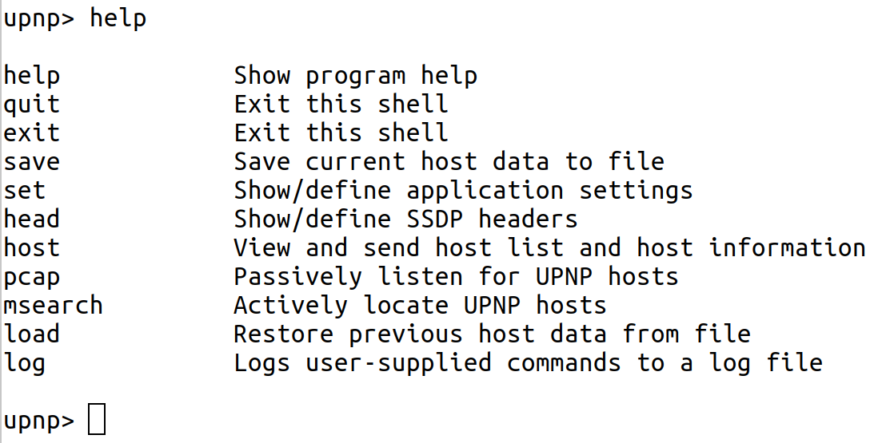

# miranda.py UPnP client - python3 compatible 

Based on [https://github.com/issackelly/wemo/blob/master/miranda.py](https://github.com/issackelly/wemo/blob/master/miranda.py) and [http://code.google.com/p/miranda-upnp/](http://code.google.com/p/miranda-upnp/).

Miranda is a UPnP client designed to discover, query and interact with UPnP devices, particularly        Internet Gateway Devices. It can be used to audit UPnP-enabled devices on a network for possible vulnerabilities.

To start:

```
python3 miranda.py
```  



Recommended to read is the original Google Documentation. But besides that a nice description how to use it can be found here: [How to discover Universal Plug and Play (UPnP) hosts using Miranda](https://medium.com/purple-team/how-to-discover-universal-plug-and-play-upnp-hosts-using-miranda-fee1bbf30000)

cf also [https://www.youtube.com/watch?v=rseMaljMcBY&t=21m15s](https://www.youtube.com/watch?v=rseMaljMcBY&t=21m15s).

From the Original Google Documentation:

# Description

Despite the wide spread use of the Universal Plug-N-Play protocol in applications, operating systems and embedded devices, few tools exist that allow simple discovery and interaction with UPnP-enabled devices. Further, of the tools that do exist, most or all are closed-source Windows binaries. Miranda is a Python-based UPnP client application designed to discover, query and interact with UPnP devices, particularly Internet Gateway Devices (aka, routers).
Features

- Interactive shell with tab completion and command history
- Passive and active discovery of UPnP devices
- Customizable MSEARCH queries (query for specific devices/services)
- Full control over application settings such as IP addresses, ports and headers
- Simple enumeration of UPnP devices, services, actions and variables
- Correlation of input/output state variables with service actions
- Ability to send actions to UPnP services/devices
- Ability to save data to file for later analysis and collaberation
- Scripting support via batch command files
- Command logging

# System Requirements

Miranda was written in Python, most functionality *should* be available for any Python-supported platform. No special Python modules are required.
CLI Usage

```
	$ ./miranda.py [OPTIONS]

	        -s <struct file>        Load previous host data from struct file
	        -l <log file>           Log user-supplied commands to log file
		-i <interface>		Specify the name of the interface to use (Linux only, requires root)
		-b <batch file>         Process commands from a file
	        -u                      Disable show-uniq-hosts-only option
		-v			Enable verbose mode
	        -d                      Enable debug mode
	        -h                      Show command line help

	If run with no options, you will be dropped into the interactive shell with the default settings.
```  
  
# Shell Usage

```
msearch 	Actively locate UPnP hosts
pcap 	Passively listen for UPnP hosts
host 	View host list and host information
save 	Save current host data to file
load 	Restore previous host data from file
log 	Logs user-supplied commands to a log file
head 	Show/define HTTP headers
set 	Show/define application settings
help 	Show program help
quit 	Exit the shell
exit 	Exit the shell
```

Many of the shell commands support various sub-commands. Miranda is designed to be as self-documenting as possible, so use '<command> help' for specific command usage, descriptions and examples.

# Usage Tutorial

## Introduction

While this tutorial will not cover every command and option available in Miranda, it will walk you through the basic usage and demonstrate the tool's major capabilities.

## Discovering UPnP Hosts

Upon running Miranda, you will be greeted with a 'upnp>' prompt. You will likely wish to discover all UPnP hosts on your network first; this can be done with the msearch or pcap commands. The difference is that pcap will passively listen for SSDP notification messages sent out by UPnP hosts, while msearch will actively query the network for UPnP hosts. In this example, we will use the msearch command:

```
			upnp> msearch 

			Entering dicovery mode for 'upnp:rootdevice', Ctl+C to stop...

			****************************************************************
			SSDP reply message from 192.168.1.1:2869
			XML file is located at http://192.168.1.1:2869/IGatewayDeviceDescDoc
			Device is running VxWorks/5.4.2 UPnP/1.0 iGateway/1.1
			****************************************************************

			Discover mode halted...
```

Here you can see that we found one host on the network (in this case, the network's Linksys router). When run without any arguments, the msearch command will query the network for all UPnP root devices. However, if we had only been interested in UPnP hosts that are of a certian device type, or that offer a particular service, we could have queried the network for only hosts matching our criteria. For example, to search only for WANDevice UPnP devices, we could have run:

```
			upnp> msearch device WANDevice
```

Likewise, if we only wanted to find hosts that support the WANIPConnection service, we could have run:

```
			upnp> msearch service WANIPConnection
```

## Listing UPnP Hosts

The 'host list' command will display all discovered hosts along with their host index number:

```
			upnp> host list 

			[0] 192.168.1.1:2869
```

Since the Linksys router was the first (and in this case, only) host discovered, it has a host index number of 0. This index number will be used to reference this particular host in subsequent commands.

## Viewing Host Info, Part 1

Before moving on, let's look at a few other host commands that we can run. At this point it is important to note that all of the 'host' commands feature full tab completion; if you're unsure of what options are available to you, or what values are in a particular piece of the host data structure, pressing TAB twice will show you.

The first command we will look at is 'host summary'; this command will display a summary of the host, along with the host's device type(s) and device info. Since we haven't enumerated any of the device types and services supported by the Linksys router, this command will only display a couple lines of information that identify the host and the location of the host's main UPnP XML file:

```
			upnp> host summary 0

			Host: 192.168.1.1:2869
			XML File: http://192.168.1.1:2869/IGatewayDeviceDescDoc
```

Next, there is the 'host info' command that lets you walk through the entire data structure that holds information about the hosts that we've discovered. Running 'host info 0' shows the following:

```
			upnp> host info 0

			xmlFile : http://192.168.1.1:2869/IGatewayDeviceDescDoc
			name : 192.168.1.1:2869
			proto : http://
			serverType : None
			upnpServer : VxWorks/5.4.2 UPnP/1.0 iGateway/1.1
			dataComplete : False
			deviceList : {}
```

You can see that the dataComplete field is set to false, indicating that we have not enumerated any detailed information about this host. However, we do know a little bit about the host just from the results of running the msearch command, including the HTTP Server header that it is using, as indicated by the upnpServer field. Note thate the value of the deviceList field is '{}'. Any field with this value indicates that it contains data sub-sets which can be further displayed with the 'host info' command like so:

```
			upnp> host info 0 deviceList
```

Because we have not discovered what type of UPnP device the Linksys router is, this command will return no data at this time.

There is also the 'host details' command that will display all devices, services, actions, arguments, etc, related to a particular host. Again, we have not discovered this information yet, and the 'host details' command tells us so:

```
			upnp> host details 0

			Can't show host info because I don't have it. Please run 'host get 0'
```

## Getting Host Details

We'll take the 'host details' suggestion and run the 'host get' command. This command will request and parse all device and service XML files that are advertised by the host, and place the extracted data into the host data structure so that we can view it using the previously mentioned host commands:

```
			upnp> host get 0

			Requesting device and service info for 192.168.1.1:2869 (this could take a few seconds)...

			Host data enumeration complete!
```

## Viewing Host Info, Part 2

Now, let's try running the 'host summary' command again and see what it reports:

```
			upnp> host summary 0

			Host: 192.168.1.1:2869
			XML File: http://192.168.1.1:2869/IGatewayDeviceDescDoc
			WANConnectionDevice
				manufacturerURL: http://www.linksys.com/
				modelName: WTR54AG
				UPC: IGateway-01
				modelNumber: WTR54AG-01
				presentationURL: None
				fullName: urn:schemas-upnp-org:device:WANConnectionDevice:1
				friendlyName: WANConnectionDevice1
				modelURL: http://www.linksys.com/
				modelDescription: WTR54AG
				UDN: uuid:34bc065f-e59a-1612-9be5-c67e816b4bfb
				manufacturer: Linksys
			WANDevice
				manufacturerURL: http://www.linksys.com/
				modelName: WRT54G
				UPC: IGateway-01
				modelNumber: WRT54G-01
				presentationURL: None
				fullName: urn:schemas-upnp-org:device:WANDevice:1
				friendlyName: WANDevice
				modelURL: http://www.linksys.com/
				modelDescription: WRT54G
				UDN: uuid:28f8f50a-e59a-1612-9be4-c67e816b4bfb
				manufacturer: Linksys
			InternetGatewayDevice
				manufacturerURL: http://www.linksys.com/
				modelName: WRT54G
				UPC: IGateway-01
				modelNumber: WRT54G-01
				presentationURL: http://192.168.1.1:80/
				fullName : urn:schemas-upnp-org:device:InternetGatewayDevice:1
				friendlyName: WRT54G
				modelURL: http://www.linksys.com/
				modelDescription: WRT54G
				UDN: uuid:13814000-4ff1-11f2-9be3-c67e816b4bfb
				manufacturer: Linksys 
```        

If we hadn't known that this was a Linksys device before, we do now! The router is actually advertising itself as three UPnP "devices": a WANConnectionDevice, a WANDevice, and an InternetGatewayDevice.

## Saving Your Data

You can also try re-running the 'host details 0' command; for clarity and brevity, the output will not be shown here as this command will spit out everything it knows about the host and its devices/services, which at this point is quite a bit. You will probably want to save this output to disk in order to view it more easily; this can be done with the 'save info' command:

```
			upnp> save info 0 wrt54g

			Host info for '192.168.1.1:2869' saved to 'info_wrt54g.mir'
```

The 'wrt54g' file name is an optional argument; if it had not been supplied, then the host index number would have been used ('info_0.mir').

If you wish to save your data to share with others or to view at a later date, you can use the 'save data' command. This will save the entire host structure that contains all the information about all of the UPnP hosts that you have discovered and enumerated during your session:

```
			upnp> save data wrt54g

			Host data saved to 'struct_wrt54g.mir'

This data can later be imported back into Miranda using the 'load' command:

			upnp> load struct_wrt54g.mir 

			Host data restored:

				[0] 192.168.1.1:2869
```

Because this data structure is saved using Python's pickle module, any other Python script can load the file for analysis using pickle.

## Analyzing Host Information

Let's now see if we can view the deviceList values with the 'host info' command that we tried earlier:

```
			upnp> host info 0 deviceList

			WANConnectionDevice : {}
			WANDevice : {}
			InternetGatewayDevice : {}
```

The three device types are listed here, and they have additional information that can be enumerated. You can explore the various fields and options as you like, but for brevity, we will examine only a couple of the most interesting; the first of these is the 'services' field which exists for each device listed in the deviceList. Taking a look at the services field for the WANConnectionDevice shows that it offers two services, WANIPConnection and WANEthernetLinkConfig:

``` 
			upnp> host info 0 deviceList WANConnectionDevice services

			WANIPConnection : {}
			WANEthernetLinkConfig : {}
```      
      
Each service also contains several sub-fields, but the one that we are most concerned with is the 'actions' field which shows the actions that each service supports (if this command looks too long to type, don't worry; use the tab completion!):

```
			upnp> host info 0 deviceList WANConnectionDevice services WANIPConnection actions

			AddPortMapping : {}
			GetWarnDisconnectDelay : {}
			GetGenericPortMappingEntry : {}
			GetSpecificPortMappingEntry : {}
			RequestTermination : {}
			ForceTermination : {}
			GetExternalIPAddress : {}
			GetConnectionTypeInfo : {}
			GetIdleDisconnectTime : {}
			GetStatusInfo : {}
			SetConnectionType : {}
			DeletePortMapping : {}
			GetAutoDisconnectTime : {}
			RequestConnection : {}
			GetNATRSIPStatus : {}
```

## Sending UPnP Commands

Now that we know what devices, services, and actions exist, we can start sending UPnP commands to the Linksys router. We will try running the GetExternalIPAddress action that is supported by the WANIPConnection service offered by the WANConnectionDevice device. To send commands to a UPnP host, use the 'host send' command; you must specify the host index number, the device name, the service name, and the action name, in that order. If the action requires any input values, you will be prompted for them automatically, as well as being informed of those value's type, allowed use, and default values/ranges, if any. The GetExternalIPAddress does not require any input, so it runs immediately:

```
			upnp> host send 0 WANConnectionDevice WANIPConnection GetExternalIPAddress

			NewExternalIPAddress : 69.123.45.678
```

The NewExternalIPAddress is the name of the output service state variable associated with the GetExternalIPAddress (some actions have several variables associated with them, but in this case there is only one), and 69.123.45.678 is the value that the UPnP host returned for that variable, which in this case is the IP address of the WAN interface.

Now let's look at a more complex request; we will attempt to forward data from port 8080 of the external WAN interface to port 80 of the router via the AddPortMapping action, essentially enabling remote administration for the router:

```
			upnp> host send 0 WANConnectionDevice WANIPConnection AddPortMapping 

			Required argument:
				Argument Name:  NewPortMappingDescription
				Data Type:      string
				Allowed Values: []
				Set NewPortMappingDescription value to: Test Description

			Required argument:
				Argument Name:  NewLeaseDuration
				Data Type:      ui4
				Allowed Values: []
				Set NewLeaseDuration value to: 0

			Required argument:
				Argument Name:  NewInternalClient
				Data Type:      string
				Allowed Values: []
				Set NewInternalClient value to: 192.168.1.1

			Required argument:
				Argument Name:  NewEnabled
				Data Type:      boolean
				Allowed Values: []
				Set NewEnabled value to: 1

			Required argument:
				Argument Name:  NewExternalPort
				Data Type:      ui2
				Allowed Values: []
				Set NewExternalPort value to: 8080

			Required argument:
				Argument Name:  NewRemoteHost
				Data Type:      string
				Allowed Values: []
				Set NewRemoteHost value to: 

			Required argument:
				Argument Name:  NewProtocol
				Data Type:      string
				Allowed Values: ['TCP', 'UDP']
				Set NewProtocol value to: TCP

			Required argument:
				Argument Name:  NewInternalPort
				Data Type:      ui2
				Allowed Values: []
				Set NewInternalPort value to: 80
```

Note that several values were required to run this action, and that we were prompted for each one. Note that boolean values are either '1' (true) or '0' (false). By leaving the NewRemoteHost value blank, we allow any remote host to use this port mapping. Since this action does not return any values, there is no output (no news is good news).

We can verify that the port mapping was successful by invoking the GetSpecificPortMappingEntry action; this action requires that we input the external port number, external host, and protocol type of the port mapping entry we are interested in:

```
			upnp> host send 0 WANConnectionDevice WANIPConnection GetSpecificPortMappingEntry 

			Required argument:
				Argument Name:  NewExternalPort
				Data Type:      ui2
				Allowed Values: []
				Set NewExternalPort value to: 8080

			Required argument:
				Argument Name:  NewRemoteHost
				Data Type:      string
				Allowed Values: []
				Set NewRemoteHost value to: 

			Required argument:
				Argument Name:  NewProtocol
				Data Type:      string
				Allowed Values: ['TCP', 'UDP']
				Set NewProtocol value to: TCP

			NewPortMappingDescription : Test Description
			NewLeaseDuration : 0
			NewInternalClient : 192.168.1.1
			NewEnabled : 1
			NewInternalPort : 80
```

Finally, we can delete this port mapping entry using the DeletePortMapping action, which requires the same input parameters as the GetSpecificPortMappingEntry action did:

```
			upnp> host send 0 WANConnectionDevice WANIPConnection DeletePortMapping 

			Required argument:
				Argument Name:  NewProtocol
				Data Type:      string
				Allowed Values: ['TCP', 'UDP']
				Set NewProtocol value to: TCP

			Required argument:
				Argument Name:  NewExternalPort
				Data Type:      ui2
				Allowed Values: []
				Set NewExternalPort value to: 8080

			Required argument:
				Argument Name:  NewRemoteHost
				Data Type:      string
				Allowed Values: []
				Set NewRemoteHost value to: 
```

Again, no news is good news, and if we try to run GetSpecificPortMappingEntry after deleting the port mapping, we get an error indicating that the port mapping no longer exists:

```
			upnp> host send 0 WANConnectionDevice WANIPConnection GetSpecificPortMappingEntry 

			Required argument:
				Argument Name:  NewExternalPort
				Data Type:      ui2
				Allowed Values: []
				Set NewExternalPort value to: 8080

			Required argument:
				Argument Name:  NewRemoteHost
				Data Type:      string
				Allowed Values: []
				Set NewRemoteHost value to: 

			Required argument:
				Argument Name:  NewProtocol
				Data Type:      string
				Allowed Values: ['TCP', 'UDP']
				Set NewProtocol value to: TCP

			Request for 'http://192.168.1.1:2869/WANIPConnCtrlUrl' failed with error code: 500
			SOAP error message: NoSuchEntryInArray
```

## Scripting UPnP Commands (currently not working)

Miranda supports a batch mode, which allows you to put Miranda commands into a file that will be run sequentially. The following batch file will:

- Set the max host discovery limit to 1 host
- Search for an Internet Gateway Device (IGD) on the network
- Get the XML description files for the first IGD
- Invoke the GetSpecificPortMappingEntry action
- Exit Miranda

Note that the arguments to the GetSpecificPortMappingEntry are entered one per line in the batch file (including any blank lines), just as they would be if you were typing them interactively:

```
			set max 1
			msearch device InternetGatewayDevice
			host get 0
			host send 0 WANConnectionDevice WANIPConnection GetSpecificPortMappingEntry
			8080
			
			TCP
			exit
```

The batch file can be loaded with the -b command line switch:

```
			$ ./miranda.py -b batch.txt
```

## Conclusion

Miranda has many other features, and is designed to be self-documenting; all of the shell commands have their own help information that detail usage and sub-commands, and provide descriptions and examples. However, the above command set comprises 99% of what you will probably want to use Miranda for, and details the steps to discover and interact with UPnP devices on your network.

# General Notes

- Base64 Data Types
    - If an input value's data type is bin.base64, you may enter the data in plain text; Miranda will base64 encode the string before sending it to the UPnP host.
        If an output value's data type is bin.base64, Miranda will base64 decode the data before displaying it to you.
- Debug Mode
    - By default the debug mode is disabled; it can be enabled by issuing the 'set debug' command from the Miranda shell, or by specifying the -d option on the command line.
    - In debug mode, the SOAP requests sent during UPnP transactions will be displayed.
    - In debug mode, the debug command is also enabled; this command will eval() whatever you pass to it, which makes it useful for viewing the contents of data structures and the like.
- Duplicate Host Entries
    - If you run the pcap/msearch commands long enough, they will see the same UPnP hosts re-broadcasting themselves on the network. By default, a host is only reported once, and duplicate discoveries of that host are ignored.
    - If you wish for duplicate discoveries to be reported, disable the unique host option using the 'set uniq' command from the Miranda shell, or by specifying the -u option on the command line.
